```{r setup, include=FALSE}
knitr::opts_chunk$set(echo = FALSE, message = FALSE, warning = FALSE)
options(tinytex.verbose = TRUE)
options(knitr.table.format = "markdown")
```

# Setup
```{r, echo = T}
library(tidyverse) # manipulación de datos en general, graficos
library(leaps) # Estimadores forward, backward, exhaustive & stepwise
library(broom) # limpieza y estructuracion de resultados de regresiones
```

# Ejercicio 1

> El “Bovine viral diarrhea virus” (BVDV) afecta el sistema gastrointestinal del ganado causando diarrea grave. Es especialmente dañino para los animales preñados, por su capacidad para infectar el feto. Se desea estimar la concentración del virus en una solución. El BVDV tiene la propiedad de que cuando se lo cultiva en un disco de Petri, las partículas virales forman placas, regiones circulares en el medio de cultivo. Estas placas son fácilmente visibles al microscopio o directamente al ojo cuando se usa un tinte. Cada placa está asociada con una sola partícula viral. Contando el número de placas -las llamadas unidades formadoras de placas (UFP) por ml. de volumen, se puede estimar la concentración viral total.

> Una dificultad para estimar la concentración total es que con una concentración suficientemente grande, todo el disco de Petri se convierte en una única gran placa, y es imposible contar las UFP individuales. Para obtener placas contables se debe diluir la solución. Esto se  hace en forma seriada. En el primer paso una parte de la solución  se mezcla con dos partes de solución estéril. Esto continúa de la misma manera, de modo que en la dilución  d, una parte de la solución d-1 se mezcla con dos partes de solución estéril. En cada paso la contaminación es 1/3 de la del paso anterior. En cada paso, 4 discos de Petri con una capacidad de 3 ml. cada uno (“réplicas”) se preparan con el material de esa dilución. Con las primeras diluciones, los discos de Petri producen innumerables placas por la sobreabundancia de partículas virales. Para poder analizar los resultados, hacen falta al menos 2 diluciones que produzcan un número de placas contable (pero no nulo).

> El proceso es: contaminar, diluir, cultivar, y contar. Como la variabilidad puede afectar cada paso, el proceso se repite varias veces (llamadas muestras). Las preguntas son:

> 1. Dados los resultados de UFP de las diluciones seriadas, ¿cómo estimar la concentración viral en la solución original (sin diluir) y la precisión del estimador?

Antes que nada, un poco de notación. $[n,m] = \{n,n+1,\dots,m\}$ denotará el conjunto de los naturales positivos de $n$ hasta $m$ inclusive, y omitiremos $n$ cuando sea igual a 1 ($[m]=[1, m]$). $X_{mdr}$ será la variable aleatoria que representa la cantidad de UFP en el cultivo de la muestra $m \in [9]$, en la dilución $[d] \in [3,9]$ y la réplica $r \in [4]$. Llamaremos $\rho$ a la concentración viral total (medida en UFP/ml.), y $\rho_m$ a la concentración viral en la muestra $m$ sin diluir. Como las UFP son relativamente escasas, la concentración viral total no se puede asumir uniforme, y por ende $\rho_m \neq \rho$. En su lugar, diremos que la concentración de las muestras son VAIID con $E(\rho_m)=\rho$. Con estimaciones de $\hat\rho_m \:\forall \:m \in [9]$, podemos estimar tanto la media como el desvio de $\rho$.

De la descripción del proceso, parece razonable suponer que las $X_{mdr}$ se distribuyen independientemente como $\text{Poisson}(\lambda_{mdr})$, donde el parámetro $\lambda_{mdr}$ depende de la concentración inicial de la muestra, el número de diluciones realizadas, el volumen de cada cultivo (que en este caso, es siempre 3ml.), y _no_ depende de la réplica. Como en los datos la primer dilución contable figura como $d=3$, pero el enunciado menciona que ese dato se obtiene luego de _dos_ diluciones, asumimos que $d=1$ se corresponde a la solución original sin diluir, y la fórmula de $\lambda_{mdr}$ resulta:

$$
\lambda_{mdr}=\rho_m\times \left(\tfrac{1}{3}\right)^{d-1}\times v_{mdr}
$$

Como asumimos que las $X_{mdr}$ son independientes entre sí, su función de densidad conjunta es igual al producto de las densidades individuales, y la estimación de los $\rho_m$ es bastante directa. Llamamos $y = (x_{111}, x_{112}, \dots, x_{994})$ al vector de todos los conteos, $\gamma = (\rho_1,\dots,\rho_9)$ al vector de todas las concentraciones muestrales, y planteamos la función de verosmilitud y su logaritmo natural:

\begin{align*}
L(\gamma|y) &= \prod_{(m,d,r) \in [9]\times[3,9]\times[4]} \frac{\lambda_{mdr}^{x_{mdr}}e^{-\lambda_{mdr}}}{x_{mdr}!} \\
\ln L(\gamma|y) &= \sum_{(m,d,r) \in [9]\times[3,9]\times[4]} x_{mdr}\ln(\lambda_{mdr})-\lambda_{mdr} - \ln(x_{mdr}!)
\end{align*}

Reemplazando $\lambda_{mdr}$ por su expresión y derivando $\ln L$ con respecto de cierto $\rho_i$ resulta:

\begin{align*}
\ln L(\gamma|y) &= \sum_{(m,d,r) \in [9]\times[3,9]\times[4]} x_{mdr} \left[\ln(\rho_m) + (d-1) \ln(1/3) + \ln(v_{mdr}) \right]-\rho_m \left(\tfrac{1}{3}\right)^{d-1} v_{mdr} - \ln(x_{mdr}!) \\
\frac{d}{d\rho_i} \ln L(\gamma|y) &= \sum_{(d,r) \in \times[3,9]\times[4]} x_{idr} \rho_i^{-1}- \left(\tfrac{1}{3}\right)^{d-1} v_{mdr}
\end{align*}

Como $v_{mdr}=v= 3\text{ml}$ para todos los cultivos, la ecuación se puede simplificar un poco más. Llamando $n_r=4$ al número de réplicas y $\bar{x}_{md} = n_r^{-1}\sum_i x_{mdi}$ al promedio de conteos entre las réplicas de una misma muestra y dilución, obtenemos:

$$
\frac{d}{d\rho_i} \ln L(\gamma|y) =  \frac{n_r}{\rho_i} \: \sum_{d \in \times[3,9]} \bar{x}_{id}- n_r \cdot v \sum_{d \in [3, 9]} \left(\tfrac{1}{3}\right)^{d-1}
$$

Finalmente, reemplazando $\rho_i$ por su EMV e igualando a cero, resulta:

$$
\hat\rho_i = \frac{\sum_d \bar{x}_{id}}{v\sum_d \left(\tfrac{1}{3}\right)^{d-1}}
$$

Al computar los EMV para cada muestra, obtenemos:

```{r}
vol <- 3 # ml/ petri
df <- read_csv("../data/5-1.csv")
rhos <- df %>%
  mutate(dilucion = dilucion - 1) %>%
  group_by(muestra, dilucion) %>%
  summarise(ufp_ = mean(ufp)) %>%
  mutate(fct_dil = (1/3)^dilucion) %>%
  summarise(
    rho = sum(ufp_) / (vol * sum(fct_dil)))

rhohat <- mean(rhos$rho)
sigma_rhohat <- sd(rhos$rho)

knitr::kable(rhos, digits = 2, col.names = c("Muestra", "$\\text{EMV}(\\rho_m)$"))
```

Aunque no observamos directamente $\rho$, todos los $\rho_m$ son realizaciones de una VA con esperanza igual a $rho$. Por ende, nuestra mejor estimación $\hat\rho$ de la concentración viral total será el promedio de las estimaciones en cada muestra, que es `r signif(rhohat, 5)` partículas virales por mililitro. El desvío estándar también se puede calcular, y es `r signif(sigma_rhohat, 4)`.

> 2. (Optativo) ¿Qué causa la mayor parte de la variación en el número de UFP/ml.?. ¿Se la puede atribuir a diferencias entre muestras y/o diferencias dentro de la mismas?.

Dentro del experimento, lo que causa la mayor parte de la variación en el número de UFP/ml, es la cantidad de diluciones realizadas. Luego, si queremos comparar la variabilidad _dentro_ o _entre_ muestras, habrá que descontar el efecto de las diluciones.

La forma que conocemos de estudiar las diferencias "entre/dentro" de cirtos grupos, es a través del análisis de la varianza, para lo cual necesitamos que los distintos grupos bajo estudio sean homocedásticos. Al estar tratando con VA de distribución Poisson, la transformación estabilizadora de la varianza que corresponde aplicar a los conteos, es la raíz cuadrada.

Consideraremos tanto a la muestra como también a la dilución como variables _categóricas_, ajustaremos un modelo multiplicativo ($\sqrt{ufp} \sim muestra \times dilución$), y compararemos las sumas de cuadrados de la tradicional tabla de ANOVA. Los gráficos de diagnóstico no muestran anomalías severas, así que presentamos directamente la tabla de suma de cuadrados para efectos principales, interacciones y "residuos":

```{r}
df <- df %>%
  mutate_at(c("muestra", "dilucion"), as_factor) %>%
  mutate_at("ufp", as.integer)

lm_ufp <- lm(sqrt(ufp) ~ muestra * dilucion, df)

tidy(anova(lm_ufp)) %>%
  transmute(
    "Coefs" = term,
    "Suma de Cuadrados" = sumsq,
    "P-valor" = as.character(signif(p.value, 3))
  ) %>%
  knitr::kable(digits = 2)
```

Desde un punto de vista explicativo, tanto el efecto principal de la muestra como las interacciones son relevantes, pero resulta evidente de los números que el factor más relevante, por lejos, es la cantidad de diluciones. Descontado este efecto, la segunda mayor suma de cuadrados es la de los "residuos", que nos está dando una medida de la variación _dentro_ de cada grupo (muestra, dilución). En otras palabras, después de las diluciones, la mayor variabilidad parece provenir de diferencias entre réplicas de una misma muestra y dilución, en tercer lugar vienen los efectos de las interacciones (que interpretamos como "variabilidad proveniente de _cómo_ se hizo cada dilución, para cada muestra") y en último lugar el efecto principal de las muestras, que da una idea de las diferencias _entre_ ellas. 

# Ejercicio 2

> Los siguientes datos corresponden a un trabajo para determinar la composición de un conjunto de vasijas de vidrio de un yacimiento arqueológico. Como el análisis espectrométrico es más barato que el análisis químico, se procuró calibrar el primero para que reemplace al segundo. Con este objetivo se tomó una muestra de 180 vasijas, a las que se realizó una espectrometria de rayos X sobre 1920 frecuencias, y también un análisis de laboratorio para determinar el contenido de 13 compuestos químicos, a saber:

> $$\ce{Na2O} \quad \ce{MgO} \quad \ce{Al2O3} \quad \ce{SiO2} \quad \ce{P2O5} \quad \ce{SO3} \quad \ce{Cl} \quad \ce{K2O} \quad \ce{CaO} \quad \ce{MnO} \quad \ce{Fe2O3} \quad \ce{BaO} \quad \ce{PbO} $$

>  Cada fila del archivo Vessel_X es el espectro de una vasija, limitado a las frecuencias 100 a 400, pues las demás tienen valores casi nulos. Cada fila del archivo Vessel_Y tiene los contenidos de los 13 compuestos en esa vasija. Se trata de predecir el compuesto 1 (óxido de sodio) usando sólo las columnas 10, 20,... etc. de X.

> 1. Para familiarizarse con los datos, grafique en función de la frecuencia las medias y varianzas de X, y también algunos espectros.

> 2. Luego tome una muestra al azar de 120 vasijas. Con ella calcule los estimadores de mínimos cuadrados, Forward y Backward; y cualquier otro que se le ocurra. Para cada estimador estime el error cuadrático medio de predicción (ECM).

> 3. Luego aplíquelos a las otras 60 vasijas  para estimar el error de predicción (este será insesgado). Compare los estimadores, y también compare las estimaciones del ECM con el inicial.

Observando detenidamente los datos y consultando con allegados capacitados en la materia, podemos concluir que

- la técnica de espectroscopía utilizada es la "fluorescencia de rayos X", 
- las frecuencias del espectro están medidas en PHz (peta-hertz, $1\times10^{15}\text{s}^{-1}$), y
- las "cantidades" de cada compuesto, son en realidad el porcentaje masa/masa (% m/m) de los óxidos en cada muestra ($100 \times \tfrac{\text{masa compuesto}}{\text{masa muestra}}$).

Al exponer un material a rayos X de longitudes de onda cortas o a rayos gamma, pueden ionizarse los átomos que constituyen el material. La ionización consiste en eyección de uno o más electrones desde el átomo. Tanto los rayos X como los gamma pueden ser suficientemente energéticos para desprender electrones fuertemente ligados en los orbitales internos del átomo. Tal remoción electrónica deja en condición inestable a la estructura electrónica del átomo, y los electrones de orbitales más elevados «caen» hacia el orbital más bajo, ocupando los "huecos" de los electrones internos desprendidos. En esta caída, o transición, se genera energía mediante emisión de un fotón. 

Existe una cantidad finita de variantes de esta transición (entre pares de capas electrónicas) y a las transiciones principales se les han asignado nombres: $K_{\alpha}, K_{\beta}, L_{\alpha}, \dots$. Cada una de estas transiciones produce un fotón fluorescente dotado de una energía característica que es igual a la diferencia de energía entre los orbitales inicial y final. La longitud de onda de esta radiación fluorescente se puede calcular a partir del postulado de Planck $\lambda = h \cdot c / E$, o si se prefiere, las longitudes de onda $\lambda$ características se pueden expresar como frecuencias, $f = c / \lambda$.

Por ejemplo, la longitud de onda correspondiente a la linea espectral $K_{\alpha}$ para el sodio (Na) es de 1.191 nanómetros [1], que nos da una frecuencia equivalente de $\tfrac{299,792,458 \:\text{m/s}}{1.191 \times 10^{-9}\text{m}} = 251.7 \times 10^{15} \text{s}^{-1} = 251.7 \: \text{PHz}$.

```{r}
vluz <- 299792458
lambdaNa <- 1.191 * 10^-9
```

A continuación, graficaremos los espectros (en escala logarítmica) para las vasijas 60 y 83, que son las de menor (0.986% m/m) y mayor (17.586% m/m) concentración de óxido de sodio, respectivamente. En gris, ĺa línea $K_{\alpha}$ del sodio, $\approx 251.7 \text{PHz}$:

```{r}
dfx <- read_csv("../data/5-2-x.csv")
dfy <- read_csv("../data/5-2-y.csv")

extremos <- dfy %>% gather("oxido", "porc", -vasija) %>%
  group_by(oxido) %>%
  summarise(
    idmax = which.max(porc),
    idmin = which.min(porc)
  )

nafreq <- round(vluz/lambdaNa * 1e-15)

df <- bind_cols(Na2O = dfy[["Na2O"]], dfx)

df %>%
  gather("freq", "value", -vasija, -Na2O) %>%
  mutate(
    vasija = as_factor(vasija),
    freq = as.integer(freq)) %>%
  filter(vasija %in% c(60, 83)) %>%
#  filter(freq >= 230, freq <= 280) %>%
  ggplot(aes(freq, log(value), color = factor(vasija))) +
  geom_line() +
  geom_vline(xintercept = vluz/lambdaNa*10^-15, alpha = 0.3) +
  labs(x = "Frecuencia [PHz]", y = "ln(Intensidad de emisión)", color = "Vasija")
```

¡Eureka! Efectivamente, la intensidad de emisión alrededor de los 252 PHz aumenta significativamente para la vasija de mayor concentración de sodio. 

Normalmente, un químico tiene una muestra pura del elemento cuya concentración se desea conocer, y utiliza su espectro como patrón de calibración para estimar la concentración en muestras de origen desconocido. Para aumentar la precisión, lo que se mide no es directamente la intensidad de la señal en la linea de emisión teórica, sino el _área debajo del espectro_, a la que se le resta una _línea de base_ de "ruido".

Trabajar de esta manera seguramente sirva para mejorar las estimaciones "mecánicas"que podemos proponer conociendo sólo de estadística, pero no es sencillo en las circunstancias actuales. Por un lado, no es fácil encontrar tablas con líneas de emisión para todos los elementos de interés, ni es obvio cómo transladar las cantidades relativas (los porcentajes masa/masa) a una escala absoluta (la intensidad de emisión) sin conocer la masa total de cada muestra. Además, el espectro está reducido a un región muy pequeña de frecuencias, y la precisión del instrumento parece más bien baja, ya que los picos alrededor de la linea teórica son bastante "gruesos" en general.

En su lugar, podemos plantear una línea de investigación menos ambiciosa: distinguir empíricamente las frecuencias donde se ven "picos" para cada elemento, buscar los estimadores forward y backward de entre dicho conjunto de frecuencias, y compararlos con los obtenidos de entre las frecuencias "múltiplo de 10" sugeridas por el enunciado. En el Apéndice incluimos gráficos similares al anterior para cada elemento, y de su análisis concluimos que existen 11 frecuencias "pico" en el espectro analizado: $\{100, 121, 145, 167, 195, 227, 252, 318, 351, 355, 386\}$ (el primer pico está por debajo de los 100PHz, pero esa es la primer frecuencia disponible; el pico de 351 está oculto debajo del de 355 en general, pero se ve claro para $\ce{K2O}$ y $\ce{MgO}$).

Aprovechando que el paquete `leaps` nos permite calcular no sólo los estimadores "forward" y "backward", sino también los "exhaustivos" (para 50 o menos covariables), y el "stepwise", buscaremos los mejores modelos por método, conjunto de frecuencias y cantidad de covariables, para las siguientes combinaciones:

```{r}
estrategias <- list(
  c(freqs = "mod10", metodo = "exhaustive"),
  c(freqs = "picos", metodo = "exhaustive"),
  c(freqs = "todas", metodo = "forward"),
  c(freqs = "todas", metodo = "backward"),
  c(freqs = "todas", metodo = "seqrep")
)

transpose(estrategias) %>%
  as_tibble %>%
  mutate_all(unlist) %>%
  knitr::kable(col.names = c("Método", "Frecuencias"))
```

Como los conjuntos "Módulo 10" ($p=31$) y "Picos" ($p=11$) son pequeños, buscaremos directamente los mejores estimadores con el método exhaustivo. Para "Todas" ($p=301$), buscaremos estimadores según cada uno de los métdos disponibles, hasta un total de 31 predictores.

La selección del "mejor modelo" constará de dos pasos. Dividiremos los datos disponibles en un conjunto de entrenamiento (_train_, n=120) y uno de prueba (_test_, n=60). El conjunto de entrenamiento se usará para determinar los modelos candidatos (uno por grupo de frecuencias, método y cantidad de variables), y de entre ellos elegiremos al que minimice el ECM en el conjunto de prueba. Contamos con un solo conjunto de prueba y por ende una única estimación puntual del ECM, así que no podemos estimar su varianza, y los criterios del estilo R1DE quedan descartados.

```{r, eval=FALSE}
# Esta celda esta cacheada para acelarar el proceso y fijar los resultados
formu <- function(freqs, oxido = "Na2O") {
  as.formula(paste(
    oxido,
    str_c("`", freqs, "`", collapse = " + "), 
    sep = " ~ "
  ))
}

get_model_formulas <- function(object, outcome){
  # get models data
  models <- summary(object)$which[,-1]
  # Get model predictors
  predictors <- apply(models, 1, function(x) names(which(x == TRUE)))
  predictors <- lapply(predictors, paste, collapse = " + ")
  # Build model formula
  map(str_c(outcome, " ~ ", predictors), as.formula)
}

frecuencias <- list(
  mod10 = seq(100, 400, 10),
  picos = c(100, 121, 145, 167, 195, 227, 252, 318, 351, 355, 386),
  todas = 100:400
)

objetivo <- "Na2O"
trCont <- trainControl(method = "repeatedcv", number = 3, repeats = 5)
ciclos <- 10
resultados <- list()

mse <- function(y, y_pred) {
  mean((y - y_pred)^2)
}

for (h in seq.int(ciclos)) {
  train_idx <- sample(c(rep(T, 120),rep(F, 60)), 180, replace = F)
  df_train <- df[train_idx,]
  df_test <- df[!train_idx,]
  train_obs <- df_train[[objetivo]]
  test_obs <- df_test[[objetivo]]
  
  for (i in seq_along(estrategias)) {
    x <- estrategias[[i]]
    freqs <- frecuencias[[x["freqs"]]]
    metodo <- x["metodo"]
    ret <- regsubsets(formu(freqs, objetivo), df_train, method = metodo, nvmax = 31)
    formulas <- get_model_formulas(ret, objetivo)
    
    for (j in seq_along(formulas)) {
      f <- formulas[[j]]
      lmObj <- lm(f, df_train)
      train_pred <- predict(lmObj)
      test_pred <- predict(lmObj, newdata = df_test)
      #trainObj <- train(f, df, method = "lm", trControl = trCont)
  
      res <- list(
        ciclo = h,
        freqs = x["freqs"],
        metodo = metodo,
        nv = j,
        f = f,
        lmObj = lmObj,
        #trainObj = trainObj,
        mse_train = mse(train_pred, train_obs),
        mse_test = mse(test_pred, test_obs)#,
        #rmse_test_sd = trainObj$results$RMSESD
      )
      resultados <- c(resultados, list(res))
    }
  }
}
tresultados <- transpose(resultados)
tresultados <- tresultados %>%
  as_tibble() %>%
  mutate_at(c("ciclo", "mse_test", "nv", "mse_train", "metodo", "freqs"), unlist)

res <- tresultados %>%
  mutate(grupo = str_c(metodo, " - ", freqs)) %>%
  select(-lmObj, -metodo, -freqs)
  
save(res, file="resultados-5-2.RData")
```


```{r}
# Resultado de la celda anterior cacheado
load("resultados-5-2.RData")
```

De los 135 modelos ajustados, a continuación presentamos los resultados para los 5 mejores:

```{r}
res %>%
  filter(ciclo == 10) %>%
  select(grupo, nv, mse_test, mse_train, f) %>%
  arrange(mse_test) %>%
  head(5) %>%
  knitr::kable(
    digits = 3,
    col.names = c("Grupo", "# Vars.", "ECM Test", "ECM Train", "Formula"))
```

Gráficamente, es interesante observar la evolución del ECM de entrenamiento y prueba para cada conjunto de frecuencia y método empleado. Aunque el ECM de entrenamiento siempre disminuye a medida que se agregan covariables, su equivalente de prueba tiende a empeorar a partir de cierto punto en que comienza el sobreajuste. Otro punto interesante, es que aunque el "mejor" modelo proviene de otro conjunto de frecuencias, la performance del grupo de "picos" es muy buena aún con pocas covariables, y no se observa un sobreajuste a medida que agregamos predictores: evidentemente, se trate de frecuencias informativas.

```{r}
res %>%
  filter(ciclo==1) %>%
  gather("kind", "mse", -grupo, -nv, -ciclo, -f) %>%
  ggplot(aes(nv, mse, color = kind)) +
  geom_line(alpha = 0.1) +
  geom_point() +
  scale_y_log10() +
  facet_wrap(~ grupo)
```

A continuación, presentamos los principales resultados del modelo elegido, junto con los gráficos de diagnóstico típicos. Vale recordar que los p-valores enunciados son estimativos, y debido a la selección de modelos no constituyen verdaderas probabilidades.

```{r}
f_optima <- res %>%
  filter(ciclo == 10) %>%
  arrange(mse_test) %>%
  head(1) %>%
  pluck("f") %>%
  .[[1]]

lm_optimo <- lm(f_optima, df)

glance(lm_optimo) %>%
  transmute(
    "R^2 aj." = as.character(signif(adj.r.squared, 3)),
    "F obs." = as.character(signif(statistic, 3)),
    "P-valor" = as.character(signif(p.value, 3))
  ) %>%
  knitr::kable()

tidy(lm_optimo) %>%
  transmute(
    "Coef." = term,
    "Estimado" = as.character(signif(estimate, 3)),
    "P-valor" = as.character(signif(p.value, 3))
  ) %>%
  knitr::kable()
```


```{r}
dffull <- augment(lm_optimo, data = df)

dffull %>%
  ggplot(aes(.fitted, .std.resid)) +
  geom_point() +
  labs(title = "Residuos estudentizadosen función del valor predicho",
       x = "Contenido Predicho", y = "Residuo") +
  theme(legend.position = "bottom")

dffull %>%
  ggplot(aes(sample = .resid)) +
  geom_qq() +
  geom_qq_line() +
  labs(title = "QQ-plot de los residuos de predicción")
```

Mas allá de un potencial outlier en el gráfico de residuos versus predichos, el modelo parece ajustar más que adecuadamente. Antes de concluir, una palabra de cautela: en casos como este, en que hay más predictores que variables, las técnicas de validación cruzada no garantizan elegir el "mejor" modelo, ya que lo que conseguimos es más bien el modelo mejor ajustado al conjunto de prueba. Para ilustrarlo, a continuación presentamos los "mejores modelos" obtenidos en 10 repeticiones idénticas del mismo proceso, salvo por la elección aleatoria de los conjuntos de prueba y entrenamiento. El lector inquieto puede comprobar personalmente que los gráficos de diagnóstico son sumamente buenos para todos ellos:

```{r}
f_imprimible <- function(f) {
  f <-Reduce(paste, deparse(f))
  if (nchar(f) <= 100) {
    return(f)
  } else {
    return(paste(substr(f, 1, 100), "..."))
  }
}

res %>%
  group_by(ciclo) %>%
  top_n(1, -mse_test) %>%
  ungroup() %>%
  mutate(f_str = map_chr(f, f_imprimible)) %>%
  select(grupo, nv, mse_test, mse_train, f_str) %>%
  knitr::kable(
    digits = 3,
    col.names = c("Grupo", "# Vars.", "ECM Test", "ECM Train", "Formula"))
```

Honestamente, no resulta intuitivo cómo avanzar en situaciones como ésta, así que habiendo obtenido un ajuste más que razonable, concluimos aquí la exploiración de los datos.

## Referencias

[1] [Líneas de análisis para fluorescencia de rayos X](https://en.wikipedia.org/wiki/X-ray_fluorescence#/
)

## Apéndice: Comparación de espectros para vasijas con mínimas y máximas cantidades de cada elemento.

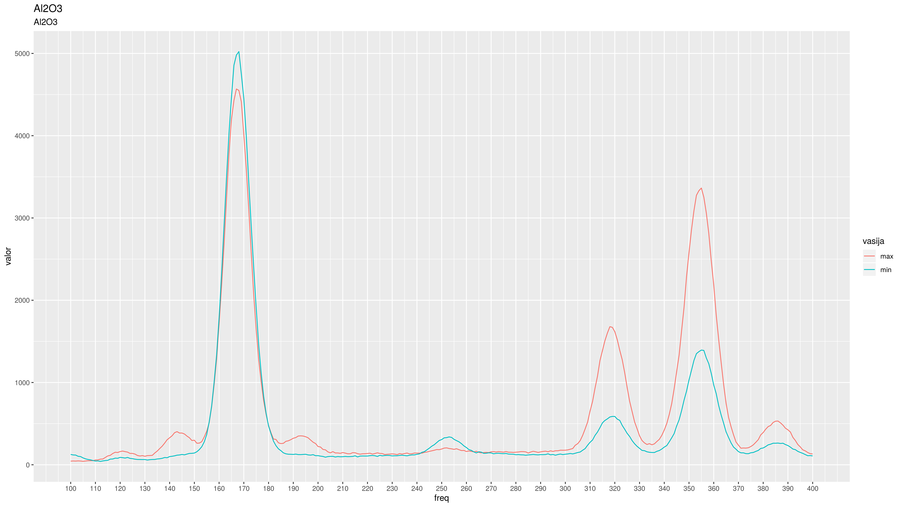
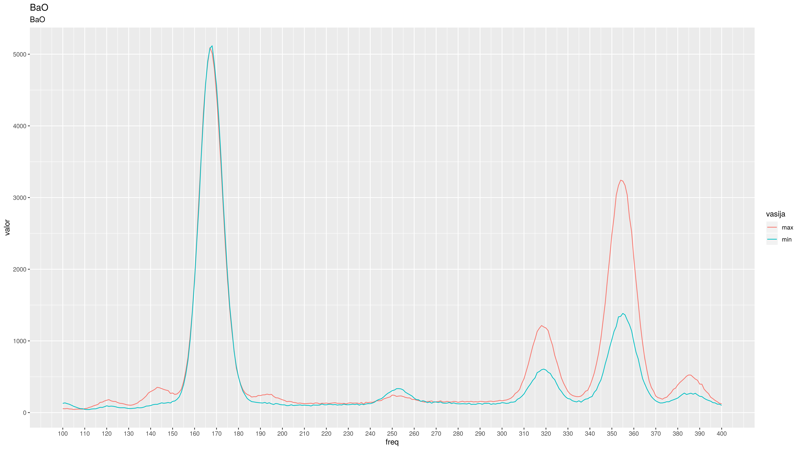
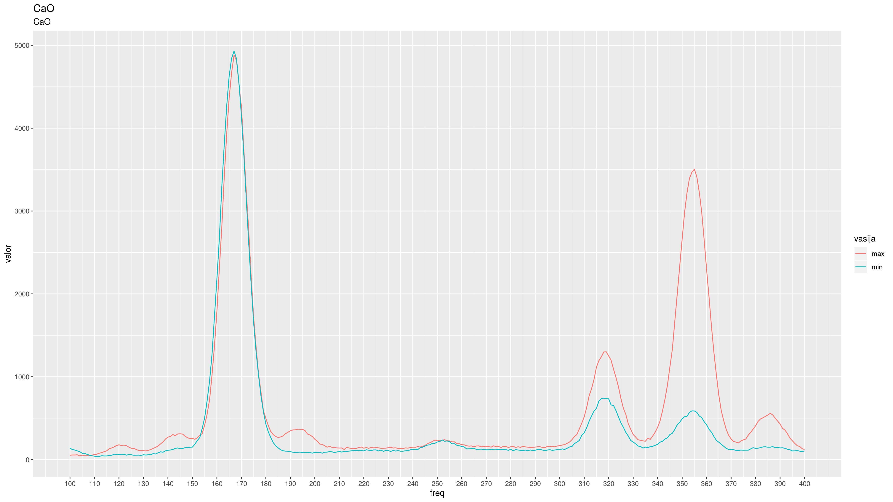
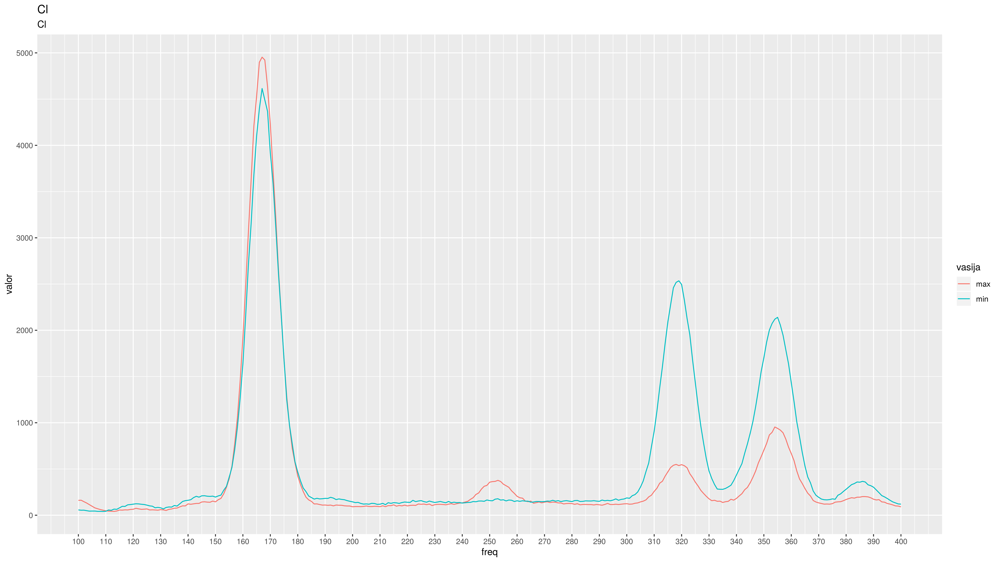
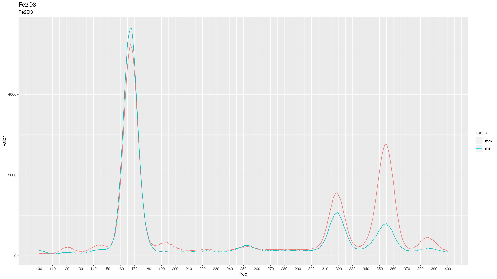
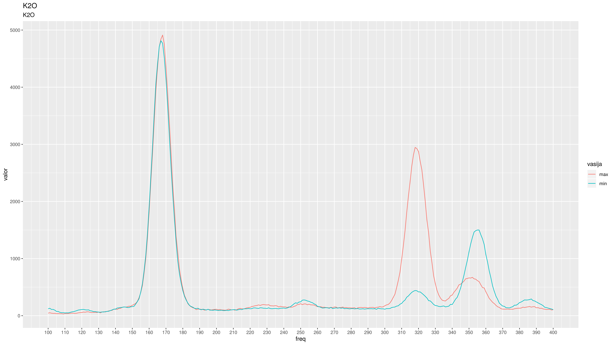
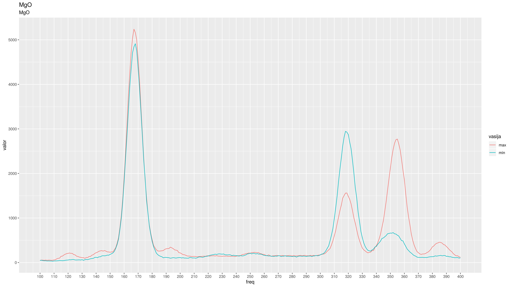
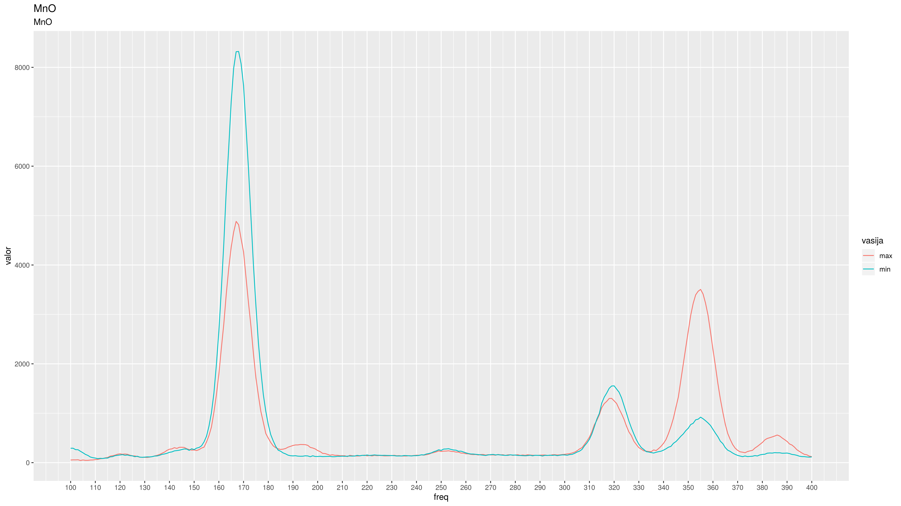
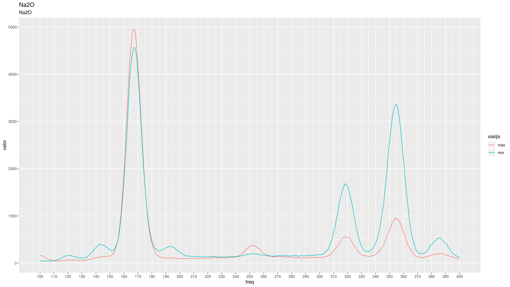
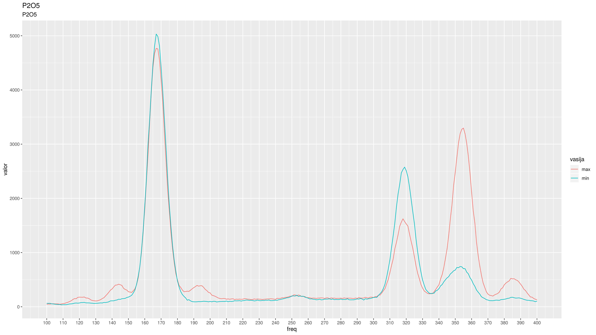
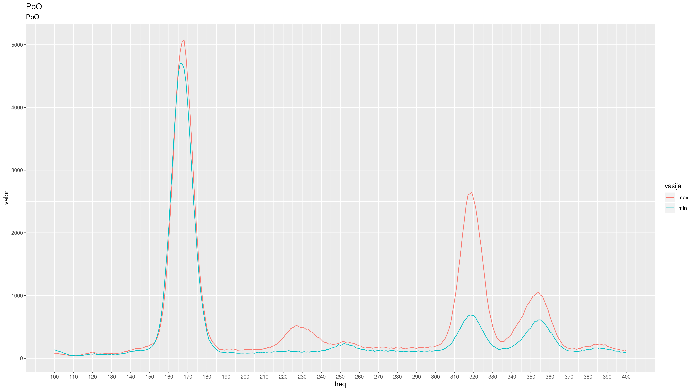
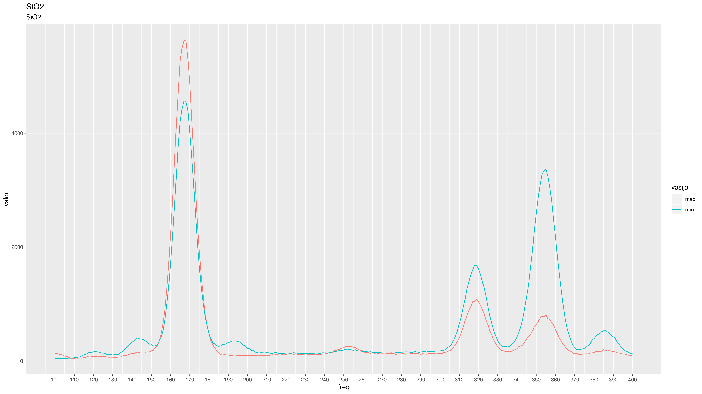
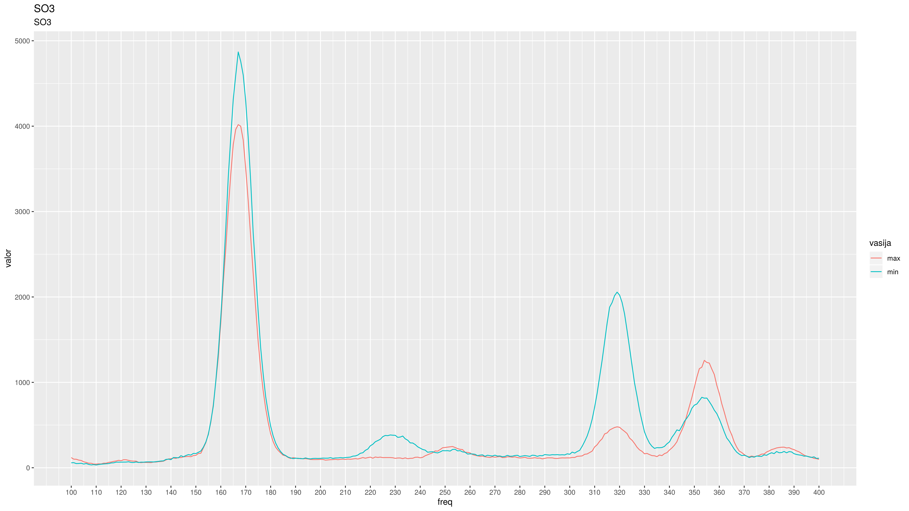